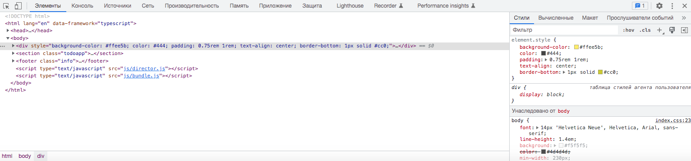

# Как найти элементы?

Google Chrome (и фактически все другие браузеры) предоставляет механизм с помощью которого вы можете вручную найти
элемент на вашей веб-странице.

1. Прежде всего, откройте веб-страницу, которую вы хотите проверить.

2. Теперь нажмите кнопку F12 на клавиатуре(или Command+option+I на Mac)

Либо просто щелкните правой кнопкой мыши в любом месте страницы и выберите - Просмотреть код

3. Вы заметите, что внизу экрана открыто окно. Это окно содержит множество разделов, одним из которых является Elements(
   Элементы), как показано на изображении ниже.

4. Кликните по иконке в виде стрелки в левом верхнем углу окна DevTools, а затем навести курсор на интересующий
   веб-элемент. Вы увидите, что html-код этого элемента отображаются в разделе «Elements»

Если вы посмотрите сведения об этом поле, вы заметите, что оно имеет некоторые свойства, такие как тег, `id`,
класс и т. д.

Таким образом, вы можете использовать средство выбора элементов, чтобы выбрать любой элемент на экране, а затем
просмотреть его детали.
