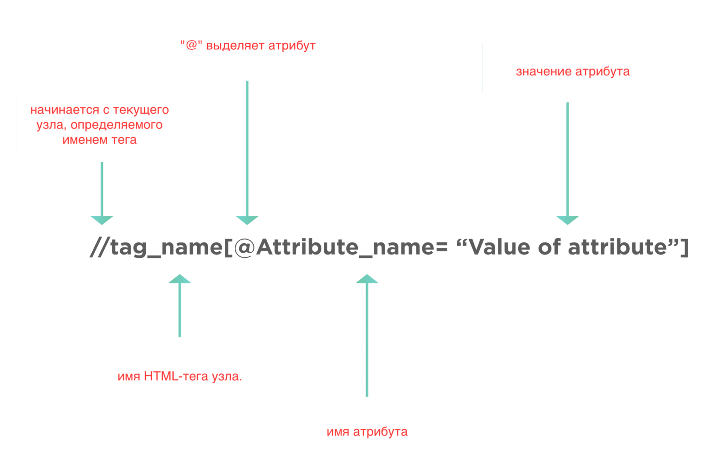

Локаторы пишут на двух языках:

+ XPath
+ CSS-селекторы

**CSS** - это аббревиатура от «Cascading Style Sheets». Используется в HTML для создания красивого макета и стилизации
веб-элемента. Селектор CSS - это шаблон пути, который может использовать теги и атрибуты веб-элемента для поиска его на
веб-странице. Это часть языка CSS, которая сообщает к каким элементам применить тот или иной стиль.

Общий синтаксис селектора CSS выглядит так:

```
tagname[attribute='attribute value']
```

**XPath** - это язык запросов для XML/HTML - документов. XPath находит любой элемент на веб-странице с помощью DOM.
Поэтому его синтаксис также состоит из атрибутов и тегов DOM.

Общий синтаксис селектора XPath выглядит так:

```
//tag_name[@attribute_name ='Value of attribute']
```



Для того чтобы использовать селекторы CSS и XPath в Рlaywright, реализован метод - `page.locator(selector, **kwargs)`

Для того чтобы явно указать передаваемый тип локатора, вам необходимо указать префикс

`css=` - если вы используете css селектор,

`xpath=` - в случае если вы передали xpath селектор.

Но даже если вы не будете указывать префикс, Рlaywright автоматически определит тип локатора. Селектор, начинающийся
с `//` или `..` будет восприниматься как селектором xpath.

## CSS

```python
page.locator("css=button").click()
```

## XPath

```python
page.locator("xpath=//button").click()
```
