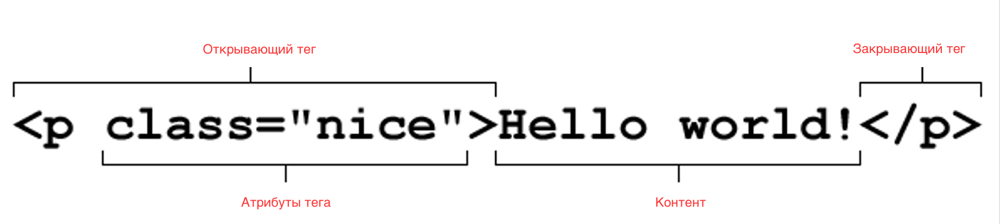
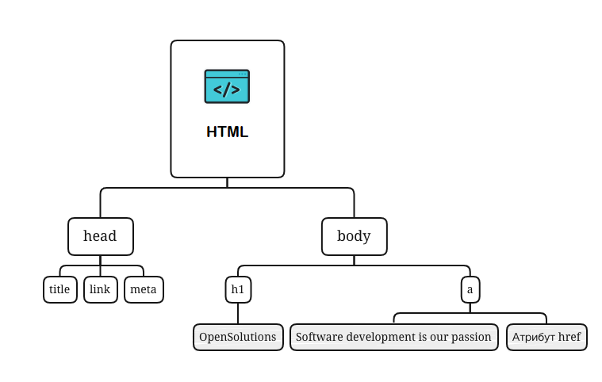

# Локаторы(Locators)

**Playwright** - это инструмент для автоматизации тестирования веб приложений. Большая часть работы с ним это работа с
веб-элементами. Веб-элемент - представляет собой DOM объекты, находящиеся на веб странице.

Чтобы извлечь информацию из любого элемента или кликнуть по веб-элементу, первым шагом является поиск элемента.

**Локаторы** - предоставляют способы поиска веб-элементов на странице.

Выбор локаторов определяет отказоустойчивость выполнения тестов. Локаторы должны быть максимально простыми. Старайтесь
придерживаться текста, идентификаторов, или селекторов CSS. Используйте более сложные селекторы только по мере
необходимости.

В следующих шагах вы познакомитесь с разнообразными возможностями поиска веб-элементов с помощью Playwright.

## HTML и что такое веб-элементы.

Как обычный пользователь, мы не задумываемся о структуре веб-страницы. Мы просто смотрим и нажимаем на то что нам нужно
в веб-приложении. Однако фреймворки, библиотеки для автоматизации тестирования не могут этого сделать. Коду нужны
указатели на нужные элементы которые мы называем локаторами или селекторами.

Чтобы получить доступ к любому веб-элементу в DOM (объектной модели документа), вам нужно будет использовать локаторы.
Возможно, одним из самых важных навыков, когда речь заходит об автоматизации веб-приложений, является поиск хороших
надежных локаторов.

### НTML

**HTML** (HyperText Markup Language, «язык гипертекстовой разметки») - язык, который создаёт каркас страницы.
HTML - это стандартный язык разметки для создания веб-страниц.

HTML дает указание браузеру, в каком виде отображать данные. Также HTML практически всегда содержит пути к другим
HTML-документам, CSS и JavaScript. Чтобы разметить контент на странице, его заключают в теги. Они указывают браузеру,
как отобразить содержимое элементов.

**Веб-элемент** - это отдельный объект, отображаемый на веб-странице/веб-приложении. Все что пользователь видит на
веб-странице, является веб-элементами.

Веб-элемент: HTML-элемент состоит из 3 частей.

1. Открывающий тег: он используется, чтобы сообщить браузеру, где начинается контент.
2. Закрывающий тег: он используется, чтобы сообщить браузеру, где заканчивается контент.
3. Контент: это фактический контент внутри открывающего и закрывающего тега.

В HTML-элементе могут быть атрибуты тегов. Атрибуты HTML предоставляют дополнительную информацию об элементах,
настраивают элементы или корректируют их поведение различными способами в соответствии с критериями, которые нужны
пользователям.

HTML-атрибуты обычно представляют собой пары «имя-значение» и всегда находятся в открывающем теге элемента.

Например, тег `<a>` создает ссылки на другие страницы или другие части страницы. Чтобы сообщить браузеру, куда ссылка
отправляет пользователя, необходимо использовать атрибут `href` в открывающем теге `<a>`.

`<a href="https://osinit.ru">Software development is our passion</a>`

Атрибут HTML class используется для указания класса для элемента HTML. Обычной практикой является, что несколько
элементов HTML могут одновременно использовать один и тот же класс. Атрибут `class` часто используется для указания на
имя класса в таблице стилей.

`
`

### DOM(Document Object Model)

**DOM** (Document Object Model) - это объектная модель страницы. Фактически это и есть HTML-разметка: блоки, из которых
состоит документ. DOM предоставляет структурированное представление документа и определяет, как эта структура может быть
доступна из программ, которые могут изменять содержимое, стиль и структуру документа. Представление DOM состоит из
структурированной группы узлов и объектов.

Когда веб-страница загружается, браузер создает документ или объект, соответствующий странице.

Модель **HTML DOM** построена в виде дерева **объектов**:

