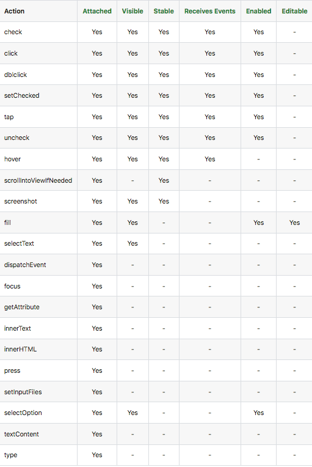

# Действия с элементами (Actions)

Playwright поставляется со встроенными [механизмами ожидания](https://playwright.dev/python/docs/actionability) при
взаимодействии со страницами.

Прежде чем предпринимать какие-либо действия, Playwright выполняет широкий спектр проверок. Он автоматически ждет, пока
пройдут все соответствующие проверки, и переходит к следующему шагу. Это происходит в течение заданного тайм-аута и
завершается неудачей, если произошла ошибка проверки.

Проверка элемента включает:

Attached - элемент присоединен к DOM. Элемент считается прикрепленным, если он подключен к DOM или ShadowRoot.
Editable - элемент редактируемый. Элемент считается редактируемым, если он включен и у него не установлено свойство
"read only".
Enabled - элемент включен. Считается включенным, если у тегов button, select, input, textarea не имеют свойства
disabled.
Receive Events - получает события, не заслоняемые другими элементами.
Stable - элемент стабилен. Элемент считается стабильным, если он сохраняет ту же область после двух или более
последовательных кадров анимации.
Visible - элемент является видимым.

Набор проверок выполняется в зависимости от выполняемого действия. В таблице ниже приведен полный список проверок для
каждого действия.

Явное ожидание элемента
Если выполнение теста требует появление определенного элемента на странице, то вы можете указать playwright явно
дождаться элемента с помощью page.wait_for_selector()
